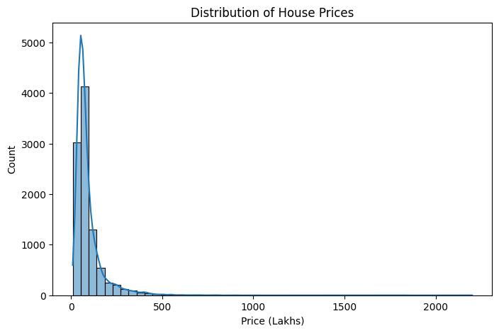
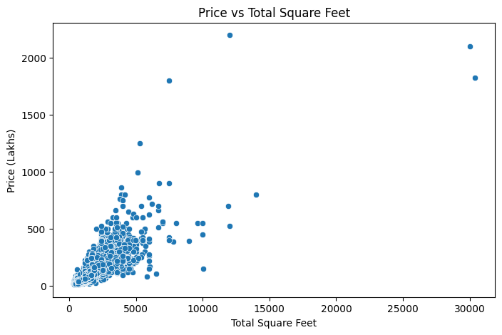
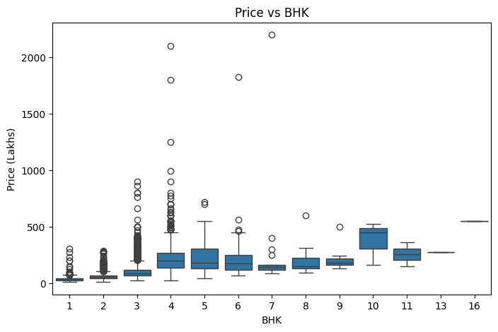
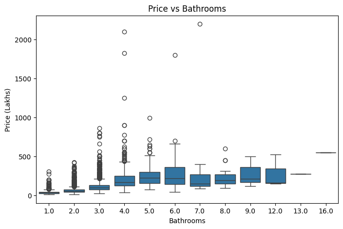
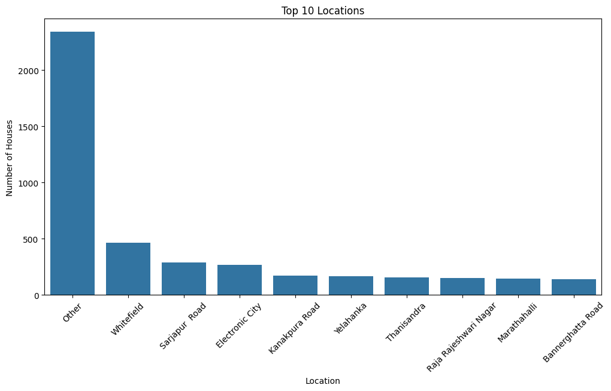
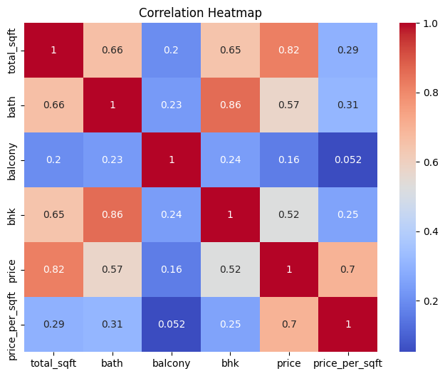
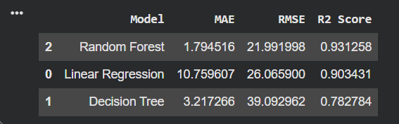
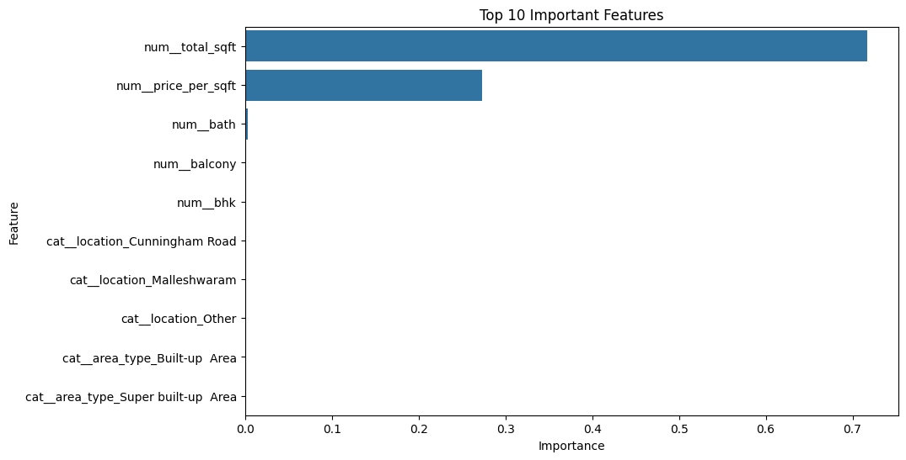

# 🏠 House Price Prediction in India using Machine Learning

> An End-to-End Machine Learning Regression project that predicts house prices in Bengaluru, India using multiple regression algorithms.

---

## 📌 Project Overview

The real estate industry generates a massive amount of housing data every day. Predicting house prices accurately helps buyers, sellers, investors, and real estate companies make informed decisions.

This project develops an end-to-end Machine Learning pipeline that predicts house prices using various housing attributes such as location, area, number of bedrooms, bathrooms, and balconies.

The project covers the complete Machine Learning lifecycle including data preprocessing, exploratory data analysis (EDA), feature engineering, model building, model evaluation, and business insights.

---

# 🎯 Objectives

- Explore and understand the housing dataset.
- Clean and preprocess the data.
- Handle missing values and outliers.
- Perform Exploratory Data Analysis (EDA).
- Engineer useful features.
- Train multiple Machine Learning models.
- Compare model performance.
- Identify the best-performing regression model.

---

# 🛠️ Technologies Used

| Category | Tools |
|----------|------|
| Language | Python |
| Notebook | Google Colab |
| Data Analysis | Pandas, NumPy |
| Visualization | Matplotlib, Seaborn |
| Machine Learning | Scikit-learn |

---

# 📂 Project Structure

```text
House-Price-Prediction-India
│
├── Datasets
├── Images
├── NoteBook
├── Report
└── README.md
```

---

# 📊 Dataset Information

**Dataset:** Bengaluru House Price Dataset

**Target Variable**

- Price

**Features**

- Area Type
- Availability
- Location
- Total Square Feet
- Size
- Bathrooms
- Balcony
- Price

---

# 🔄 Machine Learning Workflow

```
Dataset
   │
   ▼
Data Cleaning
   │
   ▼
EDA
   │
   ▼
Feature Engineering
   │
   ▼
Model Building
   │
   ▼
Model Evaluation
   │
   ▼
Business Insights
```

---

# 📈 Exploratory Data Analysis

### Distribution of House Prices



---

### Price vs Total Square Feet



---

### Price vs BHK



---

### Price vs Bathrooms



---

### Top 10 Locations



---

### Correlation Heatmap


---

# 🤖 Machine Learning Models

The following regression models were trained and evaluated to predict house prices:

- ✅ Linear Regression
- ✅ Decision Tree Regressor
- ✅ Random Forest Regressor

---

# 📊 Model Performance Comparison

| Model | MAE | RMSE | R² Score |
|:------|----:|-----:|---------:|
| Linear Regression | 26.28 | 84.37 | 0.7358 |
| Decision Tree | 4.63 | 46.01 | 0.9214 |
| **Random Forest** ⭐ | **2.27** | **32.26** | **0.9313** |

---

## 📈 Model Comparison



---

# ⭐ Feature Importance

The Random Forest model identified the following features as the most influential in predicting house prices.



---

# 💡 Key Business Insights

- 📍 Location is one of the strongest factors affecting house prices.
- 📐 Larger houses generally have higher market values.
- 🛏️ BHK significantly impacts property prices.
- 🚿 Houses with more bathrooms usually have higher selling prices.
- 📊 Removing outliers improved model performance considerably.
- 🌳 Random Forest delivered the best prediction accuracy for this dataset.

---

# 🚀 Future Improvements

- Deploy the model using **Flask** or **Streamlit**
- Integrate live housing market APIs
- Perform Hyperparameter Tuning
- Implement XGBoost and CatBoost
- Develop an interactive web application
- Build a real-time house price prediction system

---

# 📄 Report

A detailed project report is available inside the **Report** folder.

---

# 📁 Notebook

The complete implementation is available in the **NoteBook** folder.

---

# 🙋 Author

**Prashant Kumar Nandi**

Aspiring Data Analyst | Machine Learning Enthusiast | Python Learner

---

## ⭐ If you found this project useful

Please consider **starring ⭐ this repository**.

It motivates me to build and share more Machine Learning projects.

---

## 📬 Connect with Me

- GitHub: https://github.com/prasantkumar0441-alt

---

# 📌 Project Status

✅ Completed

---
